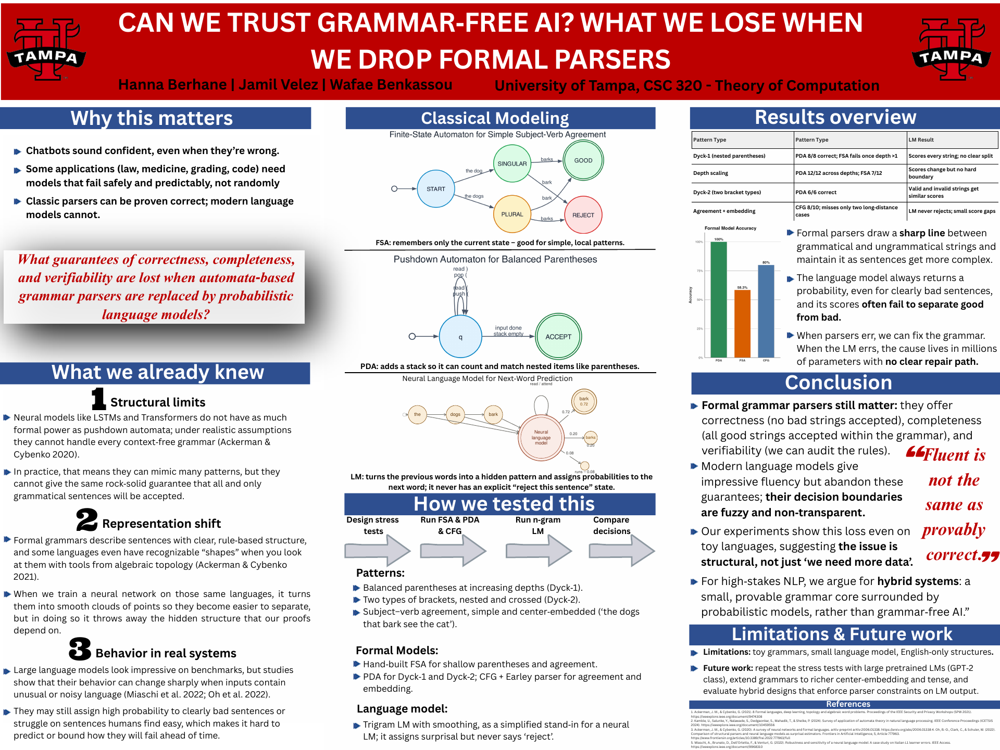
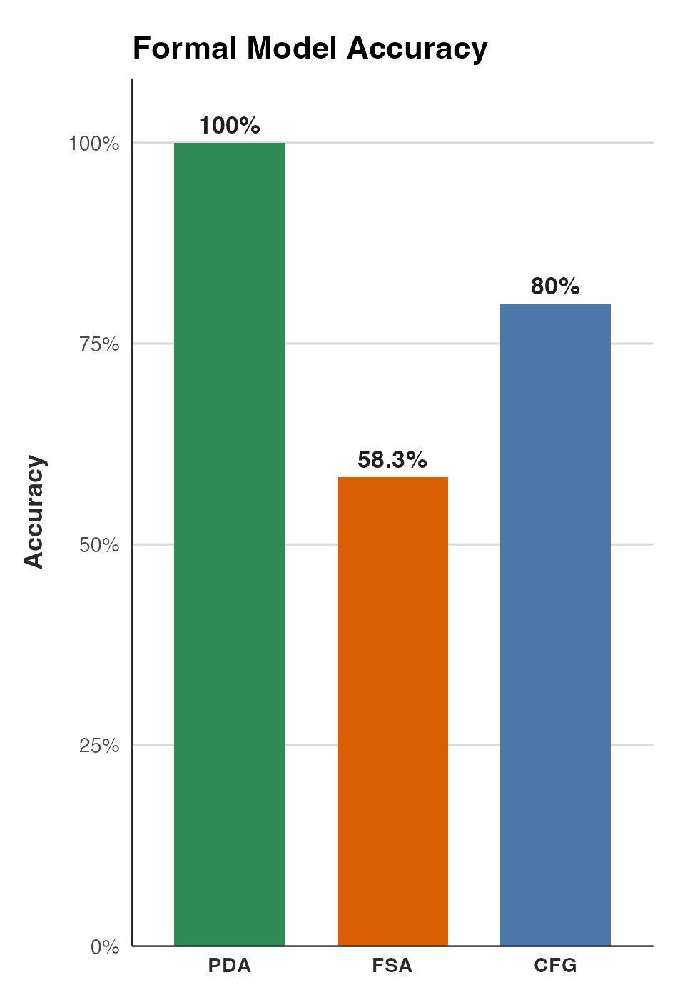

# Can We Trust Grammar-Free AI?

What we lose when we drop formal parsers.

CSC 320, Theory of Computation, University of Tampa
Hanna Berhane, Jamil Velez, Wafae Benkassou



## The question

What guarantees of correctness, completeness and verifiability are lost when automata-based grammar parsers are replaced by probabilistic language models?

Chatbots sound confident even when they're wrong. Some applications (law, medicine, grading, code) need systems that fail predictably. Classic parsers can be proven correct. Language models can't.

## What we did

**Literature review.** Five papers across formal language theory, algebraic topology, neural architecture analysis, parser comparison and robustness testing, organized into three kinds of loss:

- **Structural:** under realistic constraints, standard neural architectures sit below the context-free level of the Chomsky hierarchy, so they can't offer pushdown-automaton guarantees.
- **Representational:** training turns discrete, rule-based language structure into smooth geometry and discards the invariants that proofs depend on.
- **Behavioral:** without formal guarantees, failure modes can't be bounded or predicted from first principles.

**Stress test.** The same strings run through four models:

- a hand-built finite-state automaton (FSA) for shallow parentheses and simple agreement
- a pushdown automaton (PDA) for one and two bracket types (Dyck-1, Dyck-2)
- a context-free grammar with an Earley parser (NLTK) for subject-verb agreement, relative clauses and center-embedding ("the dogs that bark see the cat")
- a trigram language model with smoothing, scored by surprisal, as a simplified stand-in for a neural language model

## Results

| Test | Formal models | Language model |
|---|---|---|
| Balanced parentheses (8 strings) | PDA 8/8, FSA 5/8 (fails past depth 1) | |
| Depth scaling, depths 1 to 6 (12 strings) | PDA 12/12, FSA 7/12 | |
| Two bracket types (6 strings) | PDA 6/6 | Scores every string; valid and invalid get similar surprisal |
| Agreement and center-embedding (10 sentences) | CFG 8/10; both misses are long-distance agreement the grammar doesn't cover yet | Never rejects; average surprisal was slightly *lower* on ungrammatical sentences (16.1 bits) than grammatical ones (17.2) |



**Takeaway.** Formal parsers draw a sharp line between grammatical and ungrammatical strings and keep it as sentences get more complex. When they're wrong, you can see which rule is missing and add it. The language model always returns a probability, even for clearly bad sentences, and when it's wrong there's no clear repair path. For high-stakes language tasks we argue for hybrid systems: a small, provable grammar core surrounded by probabilistic models.

**Limitations.** Toy grammars, a small trigram model rather than a neural one, English-only structures. Next steps: repeat the tests with large pretrained models (GPT-2 class), extend the grammar to richer center-embedding and tense, and test hybrid designs that enforce parser constraints on model output.

## Files

```
experiment.py      all four experiments and the summary
paper/             final paper and annotated bibliography
poster/            poster (PDF and preview image)
figures/           FSA and PDA diagrams (Graphviz .dot), accuracy chart (R)
```

## Run it

```bash
pip install -r requirements.txt
python3 experiment.py
```

## References

1. Ackerman, J. M., & Cybenko, G. (2021). Formal languages, deep learning, topology and algebraic word problems. IEEE Security and Privacy Workshops.
2. Kamble, U., et al. (2024). Survey of application of automata theory in natural language processing. ICETSIS 2024.
3. Ackerman, J. M., & Cybenko, G. (2020). A survey of neural networks and formal languages. arXiv:2006.01338.
4. Oh, B.-D., Clark, C., & Schuler, W. (2022). Comparison of structural parsers and neural language models as surprisal estimators. Frontiers in Artificial Intelligence.
5. Miaschi, A., Brunato, D., Dell'Orletta, F., & Venturi, G. (2022). Robustness and sensitivity of a neural language model: A case study on Italian L1 learner errors. IEEE Access.
